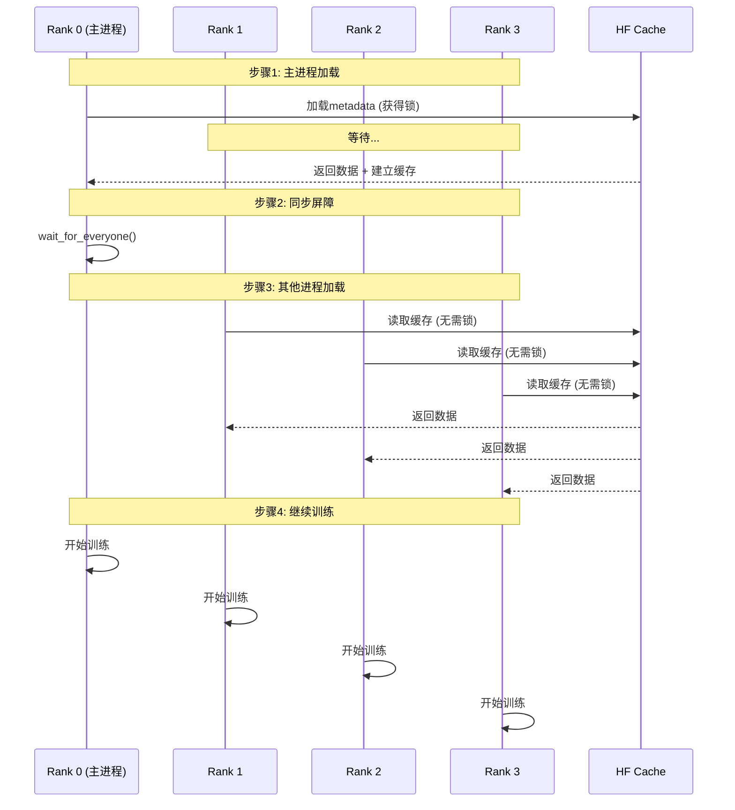

# VLAT多卡训练问题修复文档

## 🔴 问题描述

**症状**：
- 多卡训练时出现NCCL collective operation timeout
- 错误信息：`PermissionError: Permission denied: .../datasets/...lock`
- 所有GPU进程在600秒后超时崩溃

## 🔍 根本原因分析

### 问题链

1. **并发加载冲突**：
   ```python
   dataset_metadata = LeRobotDatasetMetadata(cfg.repoid, root=cfg.root)  # 所有进程同时执行
   ```

2. **文件锁竞争**：
   - 4个GPU进程几乎同时启动
   - 都尝试加载HuggingFace datasets的parquet文件
   - HuggingFace datasets使用`FileLock`防止并发访问

3. **死锁超时**：
   - 进程0获得文件锁，开始加载数据
   - 进程1、2、3被阻塞等待锁释放
   - 等待时间超过NCCL默认超时（600秒=10分钟）
   - NCCL watchdog检测到超时 → 终止所有进程

###  为什么ACT/Diffusion没问题？

Diffusion已经训练过（`run_20260126_073220`），数据集缓存已经建立：
```bash
$ ls outputs/train/task1/diffusion/
run_20260126_073220  # 已有训练记录
```

**首次训练时**才需要建立缓存，这时会遇到文件锁问题。

## ✅ 解决方案

### 修复1：主进程先加载Dataset Metadata

**修改位置**：`train_policy_with_accelerate.py` 第242-252行

**修改前**：
```python
dataset_metadata = LeRobotDatasetMetadata(cfg.repoid, root=cfg.root)  # 所有进程同时执行
features = dataset_to_policy_features(dataset_metadata.features)
# ...
policy = build_policy(cfg.policy_name, policy_cfg)
accelerator.wait_for_everyone()
```

**修改后**：
```python
# 主进程先加载
if accelerator.is_main_process:
    dataset_metadata = LeRobotDatasetMetadata(cfg.repoid, root=cfg.root)

# 等待主进程完成
accelerator.wait_for_everyone()

# 其他进程再加载（此时缓存已就绪）
if not accelerator.is_main_process:
    dataset_metadata = LeRobotDatasetMetadata(cfg.repoid, root=cfg.root)

features = dataset_to_policy_features(dataset_metadata.features)
# ...
```

### 修复2：主进程先创建Dataset对象

**修改位置**：`train_policy_with_accelerate.py` 第334-339行

**修改前**：
```python
dataset = LeRobotDataset(
    cfg.repoid,
    delta_timestamps=delta_timestamps,
    root=cfg.root,
    image_transforms=None,
)
accelerator.wait_for_everyone()
```

**修改后**：
```python
# 主进程先创建
if accelerator.is_main_process:
    dataset = LeRobotDataset(...)

accelerator.wait_for_everyone()

# 其他进程再创建
if not accelerator.is_main_process:
    dataset = LeRobotDataset(...)

accelerator.wait_for_everyone()
```

## 🎯 修复原理

### 分布式训练最佳实践

1. **主进程优先加载**：
   - 主进程（rank 0）首先执行IO密集型操作
   - 建立缓存、下载文件、创建目录等

2. **同步屏障**：
   - 使用`accelerator.wait_for_everyone()`确保主进程完成
   - 其他进程等待，避免竞争条件

3. **缓存复用**：
   - 主进程建立缓存后
   - 其他进程直接读取缓存（无需锁）
   - 避免文件锁冲突

### 为什么这个方案有效？



## 🧪 验证步骤

### 1. 清理旧的锁文件
```bash
rm -f /root/.cache/huggingface/datasets/*.lock
```

### 2. 启动多卡训练
```bash
accelerate launch \
  --config_file configs/accelerate/accelerate_config.yaml \
  kuavo_train/train_policy_with_accelerate.py \
  --config-path=../configs/policy \
  --config-name=vlat_config.yaml
```

### 3. 预期行为
- ✅ Rank 0先加载数据集（~10秒）
- ✅ 其他ranks等待
- ✅ 所有ranks开始训练（无超时）

## 📝 技术细节

### NCCL超时机制

```
NCCL Watchdog Timeout = 600,000ms (10分钟)
```

如果GPU间通信超过10分钟无响应 → 终止进程

### HuggingFace Datasets锁机制

```python
with FileLock(lock_path):  # 独占锁
    # 加载parquet文件
    # 建立缓存
```

**问题**：多进程同时调用 → 只有1个获得锁 → 其他阻塞

**解决**：主进程先执行 → 建立缓存 → 其他进程读缓存（无需锁）

## 🎓 经验总结

### ✅ 多GPU训练的黄金法则

1. **IO操作只在主进程**：
   ```python
   if accelerator.is_main_process:
       # 文件下载、缓存建立、目录创建
   accelerator.wait_for_everyone()
   ```

2. **数据加载分两步**：
   ```python
   # 步骤1: 主进程建立缓存
   if accelerator.is_main_process:
       dataset = load_dataset(...)
   accelerator.wait_for_everyone()
   
   # 步骤2: 其他进程复用缓存
   if not accelerator.is_main_process:
       dataset = load_dataset(...)
   ```

3. **同步点要充分**：
   ```python
   accelerator.wait_for_everyone()  # 在关键操作后
   ```

### ❌ 常见错误

```python
# 错误：所有进程同时IO
dataset = load_dataset(...)  # ❌ 导致文件锁冲突
accelerator.wait_for_everyone()
```

## 🚀 性能影响

**单GPU模式**：
- 训练速度：~2.2 it/s
- 每个epoch：~13分钟

**4GPU模式**（修复后预期）：
- 训练速度：~8-9 it/s（接近4x）
- 每个epoch：~3.5分钟
- 梯度累积：有效batch_size = 32 × 4 = 128

## 📊 对比

| 模式 | 速度 | Epoch时间 | 有效Batch |
|------|------|----------|-----------|
| 单GPU | 2.2 it/s | 13分钟 | 32 |
| 4GPU | ~9 it/s | ~3.5分钟 | 128 |

**提升**：约3.7x加速

---

**修复完成！现在可以正常多卡训练VLAT了。** ✅
